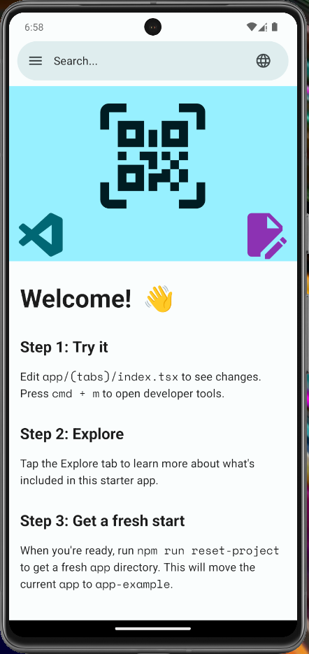
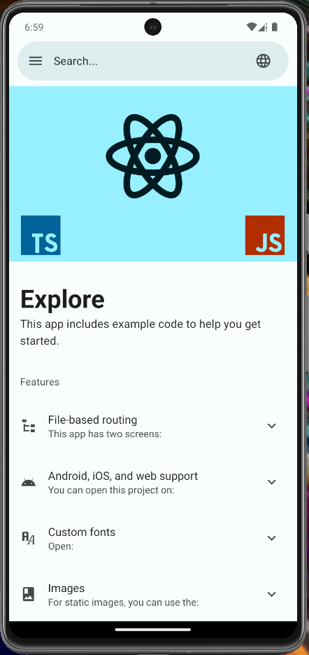
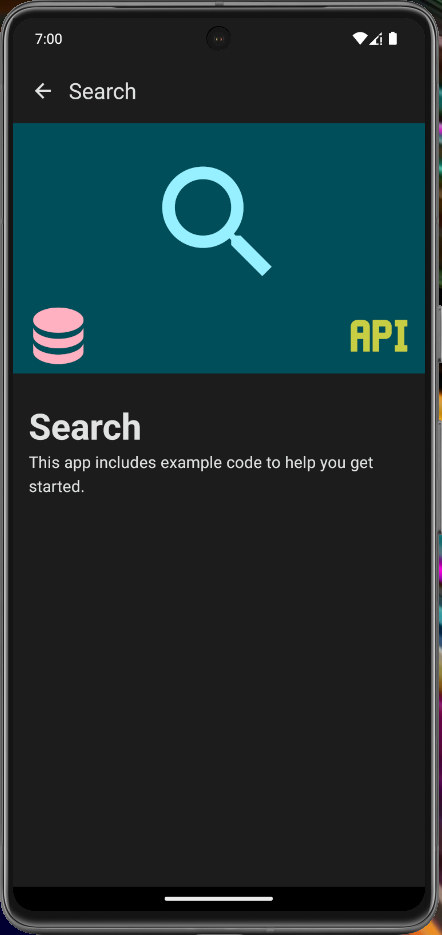

# expo-material-drawer

[](https://github.com/youzarsiph/expo-material-drawer/actions/workflows/eas-build.yml)
[](https://github.com/youzarsiph/expo-material-drawer/actions/workflows/eas-reviews.yml)
[](https://github.com/youzarsiph/expo-material-drawer/actions/workflows/eas-update.yml)
[](https://github.com/youzarsiph/expo-material-drawer/actions/workflows/codeql.yml)
[](https://github.com/youzarsiph/expo-material-drawer/actions/workflows/eslint.yml)
[](https://github.com/youzarsiph/expo-material-drawer/actions/workflows/prettier.yml)

## Overview

The `expo-material-drawer` template is a robust foundation for developing modern, cross-platform mobile and web applications using the Expo platform. Leveraging Material Design V3, it offers a sleek and intuitive user interface. The template supports both light and dark themes, ensuring a seamless and adaptive experience across various devices and environments.

## Screenshots





## Key Features

- **Expo Framework**: Simplifies the development process with pre-built APIs and tools.
- **Expo Router**: Streamlines navigation and routing for a seamless user journey.
- **Material Design V3**: Aligns with the latest design guidelines for a modern look.
- **Theming**: Supports customizable light and dark themes for enhanced user experiences.
- **Cross-Platform Support**: Target Web, iOS, and Android with a single codebase.
- **CI/CD Integration**: Utilizes GitHub Actions for automated builds, code reviews, and updates.
- **TypeScript**: Ensures type safety and robustness in your codebase.
- **React Native Paper**: Integrates Material Design components for rich UI elements.

## Supported Platforms

- **Web**
- **iOS**
- **Android**

## Getting Started

This section provides a comprehensive guide to setting up the project on your local machine.

### Prerequisites

Ensure the following prerequisites are met:

- **Node.js**: A JavaScript runtime environment. [Installation Guide](https://nodejs.org/en/download/)
- **npm**: A package manager for JavaScript. [Installation Guide](https://docs.npmjs.com/downloading-and-installing-node-js-and-npm)

### Installation

1. **Clone the Repository**:

   ```bash
   git clone https://github.com/youzarsiph/expo-material-drawer.git
   cd expo-material-drawer
   ```

2. **Configure Project Name**:

   Update the `name` field in `package.json` to reflect your application's name:

   ```jsonc
   {
     "name": "your-application-name",
     ...
   }
   ```

3. **Install Dependencies**:

   Execute the following command to install all required dependencies:

   ```bash
   npm install
   ```

4. **Launch the Application**:

   Start the application using the following command:

   ```bash
   npm start
   ```

## Technology Stack

- **TypeScript**: A statically typed language enhancing code reliability.
- **React**: A versatile JavaScript library for building user interfaces.
- **React Native**: A framework for developing native mobile applications.
- **Expo**: A comprehensive platform for universal React applications.
- **Expo Router**: A flexible navigation library for React Native.
- **React Native Paper**: A rich set of Material Design components for React Native.

## Contributing

We welcome contributions from the community. To contribute, please follow these steps:

1. **Fork the Repository**: Create a fork of the `expo-material-drawer` repository on GitHub.
2. **Create a Feature Branch**: Branch out from the `main` branch into your new branch.
3. **Make Your Changes**: Implement your desired features or improvements.
4. **Commit Your Changes**: Use clear and descriptive commit messages.
5. **Push and Open a Pull Request**: Push your changes to your fork and submit a pull request for review.

Ensure that your contributions align with the project's coding standards and guidelines.

## License

The `expo-material-drawer` template is licensed under the MIT License. For more details, refer to the [LICENSE](LICENSE) file.

## Contact

For further information, support, or inquiries, please contact the project maintainers or visit the [GitHub repository](https://github.com/youzarsiph/expo-material-drawer).
